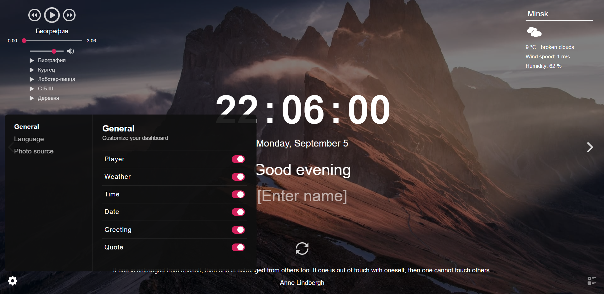

# Denis Kovalev

## Contacts

- Location: Gomel, Belarus
- Phone: +375 29 607 07 57
- Email: ds.kavaliou@gmail.com
- Discord: kovalev-ds (@kovalev-ds)

## About Me

I worked as a team leader for a furniture company that is one of IKEA's clients. This gave me a huge experience and understanding of the management and organization of production processes. I used technologies and conceptions like **5s**, **lean manufacturing**, **kanban** and **just in time**;

A couple of years ago I got into IT because I like to solve problems and find interesting solutions. The process of programming itself calms and focuses, which at the moment is a good and promising hobby.

## Skills

- HTML, CSS (SCSS, BEM), JavaScript (ES6+)
- CSS Frameworks (Bootstrap, Tailwind)
- React (Hooks, Redux, CSS in JS, Compound Components, Next.js, Gatsby.js)
- Node.js (Express.js)
- SQL (Postgres, MySql, MSSQL)
- NoSQL (Mongo)
- Webpack
- REST, Graphql
- Docker
- Git/GitHub

## Code example

#### DESCRIPTION:

Implement function check(str, bracketsConfig), that for given brackets sequence will return true if it is correct and false otherwise

In the second param there is bracketsConfig - the array of pairs open-closed brackets. Each subarray includes only 2 elements - opening and closing bracket

```js
check("()", [["(", ")"]]); // -> true
check("((()))()", [["(", ")"]]); // -> true
check("())(", [["(", ")"]]); // -> false
```

#### SOLUTION:

```js
function check(str, bracketsConfig) {
  return (
    [...str].reduce(
      (stack, v) =>
        bracketsConfig.some(
          ([left, right]) => stack[stack.length - 1] === left && v === right
        )
          ? (stack.pop(), stack)
          : (stack.push(v), stack),
      []
    ).length === 0
  );
}
```

## Experience

#### Project 'Momentum':

[](https://rolling-scopes-school.github.io/kovalev-ds-JSFEPRESCHOOL2022Q2/momentum/)

#### Project 'Travel':

[](https://rolling-scopes-school.github.io/kovalev-ds-JSFEPRESCHOOL2022Q2/Travel/)

## Education

- University: Francisk Skorina Gomel State University, Physics and IT (in proccess)
- Courses:
  - JavaScript https://learn.javascript.ru/
  - RS Schools Course 2022 Q2 [Certificate](https://app.rs.school/certificate/axrekcog)
  - RS Schools Course 2022 Q3 (in proccess)

## English

B1 (in proccess)
